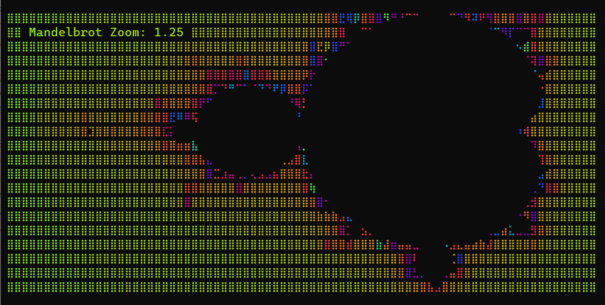

# Moon Drawille

Terminal graphics library using Unicode Braille characters for MoonBit.

## Overview

`cg-zhou/drawille` is a high-performance terminal graphics library for MoonBit, inspired by the concept of Unicode Braille-based rendering. It provides a logical canvas that allows you to draw high-density graphics in traditional text-based terminals by leveraging the 2x4 dot grid available in Braille characters.

This is a clean-room implementation in MoonBit, designed to be lightweight, efficient, and easy to integrate into other MoonBit projects.

## Features

- **High-density graphics**: 8 pixels per terminal character.
- **ANSI Color Support**: 16-color ANSI and TrueColor (RGB) support.
- **Text Overlay**: Mix text and graphics on the same canvas seamlessly.
- **Pure MoonBit**: No external dependencies other than the standard library.

## API Documentation

The library provides a high-level `Canvas` interface:

- `Canvas::new()` - Create a new canvas.
- `Canvas::set(x: Int, y: Int)` - Draw a pixel.
- `Canvas::unset(x: Int, y: Int)` - Erase a pixel.
- `Canvas::stroke_line(x1: Int, y1: Int, x2: Int, y2: Int)` - Draw a line.
- `Canvas::set_text(x: Int, y: Int, text: String, style? : Style)` - Draw text with optional styling.
- `Canvas::render(options? : RenderOptions)` - Render canvas to a string for terminal display.

## License

MIT

